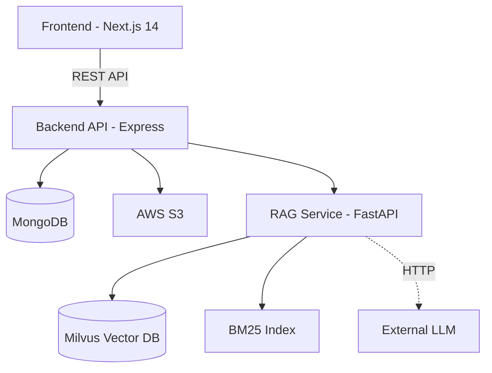

# 🎓 RAG Chat with PDF — Capstone Project

Intelligent document analysis using Retrieval-Augmented Generation (RAG). Stack: Next.js frontend, Express API, Python RAG service, Milvus vector DB.

## 🏗️ System Architecture



## 🚀 Key Features

- 💬 Chat interface with source-attributed answers
- 📄 PDF, DOCX, TXT support
- 🔍 Hybrid search (dense embeddings + BM25) with cross-encoder reranking
- 🔐 JWT RS256 auth, per-user RSA encryption, workspace isolation
- 🌙 Light/dark theme
- 📊 Microservice architecture

## 🛠️ Tech Stack

| Layer | Stack |
|-------|-------|
| Frontend | Next.js 14 (App Router), React 18, TypeScript, Tailwind + shadcn/ui, React Query, React Hook Form + Zod |
| Backend | Express, TypeScript, Mongoose, JWT RS256, AWS S3, Winston, Helmet |
| RAG | FastAPI, BAAI/bge-m3 (1024-dim), Milvus 2.3, BM25, cross-encoder reranker, remote LLM (Llama 3.2 3B) |
| Infra | Docker Compose: etcd, MinIO, Milvus, Python, Node, Next.js |

## 📋 Prerequisites

- Docker 20.10+ and Docker Compose 2.0+
- 8 GB RAM, 20 GB disk
- (Optional) Node 18+, Python 3.11 for local dev

## 🚀 Quick Start

```bash
git clone <repository-url>
cd capstone-project
cp env.example .env          # fill in DB_URL, AWS_*, etc
docker-compose up -d
docker-compose ps            # wait ~2 min for Milvus
```

Access:

- Frontend: http://localhost:3000
- API: http://localhost:3001/api
- RAG: http://localhost:8080
- MinIO Console: http://localhost:9001

## 📁 Project Structure

```
capstone-project/
├── client/             # Next.js 14 frontend
├── node-server/        # Express API (TypeScript)
├── python-server/      # FastAPI RAG service
├── translator/         # EN→VI translation pipeline
├── llm/                # LLM fine-tuning scripts
├── docs/               # English documentation
├── docker-compose.yml
└── env.example
```

See [docs/codebase-summary.md](./docs/codebase-summary.md) for per-service trees.

## 📚 Documentation

| Document | Purpose |
|----------|---------|
| [project-overview-pdr.md](./docs/project-overview-pdr.md) | Product goals, scope, acceptance criteria |
| [codebase-summary.md](./docs/codebase-summary.md) | Service breakdown, dependencies, APIs |
| [code-standards.md](./docs/code-standards.md) | TypeScript/Python conventions, error handling |
| [system-architecture.md](./docs/system-architecture.md) | Detailed diagrams, data flows |
| [deployment-guide.md](./docs/deployment-guide.md) | Docker setup, troubleshooting, scaling |
| [project-roadmap.md](./docs/project-roadmap.md) | Status, known issues, future phases |
| [design-guidelines.md](./docs/design-guidelines.md) | UI design system, components |

## 💻 Local Development

```bash
# Frontend
cd client && yarn install && yarn dev          # :3000

# Backend
cd node-server && yarn install && yarn dev     # :3000

# RAG service
cd python-server
python -m venv venv && source venv/bin/activate
pip install -r requirements.txt
python app/main.py                             # :8080
```

Full-stack without Docker requires local MongoDB + Milvus — see [deployment-guide.md](./docs/deployment-guide.md).

## 🧪 API Surface

**Auth (`/api/auth/*`):** `register`, `login`, `logout`, `refresh-token`, `rotate-keys`, `public-key/:userId`, `encrypt`, `decrypt`

**Files (`/api/files/*`):** `embed` (multipart), `workspaces`, `workspace/:slug`, `workspace/:slug/query`, `workspace/:slug/messages`

**RAG service:** `GET /` health, `POST /query`, `POST /embed`

See [codebase-summary.md](./docs/codebase-summary.md) for request/response shapes.

## ⚙️ Environment Variables

```bash
DB_URL="mongodb+srv://..."
ACCESS_TOKEN_VALIDITY_SEC=3600
REFRESH_TOKEN_VALIDITY_SEC=86400
AWS_ACCESS_KEY_ID="..."
AWS_SECRET_ACCESS_KEY="..."
AWS_REGION="us-east-1"
AWS_BUCKET="..."
NEXT_PUBLIC_APP_URL="http://localhost:3000"
NEXT_PUBLIC_API_URL="http://localhost:3001/api"
EMBEDDING_MODEL="BAAI/bge-base-en-v1.5"
HUGGING_FACE_HUB_TOKEN="..."
MILVUS_URI="http://milvus:19530"
MASTER_ENCRYPTION_KEY="..."
```

Full reference in [deployment-guide.md](./docs/deployment-guide.md).

## ✅ Health Checks

```bash
docker-compose ps
curl http://localhost:3000           # Frontend
curl http://localhost:3001/health    # API
curl http://localhost:8080/          # RAG
curl http://localhost:9091/healthz   # Milvus
```

## 🐛 Troubleshooting

- **Milvus slow to start:** increase `milvus.healthcheck.start_period` in `docker-compose.yml`
- **Mongo connection fails:** verify `DB_URL`, IP allowlist (Atlas), or local service
- **Python service crashes:** `docker-compose logs python-server`, then `docker-compose build python-server`

More in [deployment-guide.md](./docs/deployment-guide.md#troubleshooting).

## 🗺️ Roadmap Highlights

- Tests (Jest + pytest) and CI/CD
- Move hardcoded LLM IP to env var
- Rate-limit auth endpoints (deps already installed)
- Consolidate dual file-upload paths and duplicate `useAuth` hook
- Observability (Prometheus + Grafana)
- Kubernetes migration

Full backlog in [project-roadmap.md](./docs/project-roadmap.md).

## 🤝 Contributing

1. Read [code-standards.md](./docs/code-standards.md)
2. Branch: `git checkout -b feature/your-feature`
3. Commit with [Conventional Commits](https://www.conventionalcommits.org/)
4. Open a PR

---

**Last Updated:** 2026-06-20
