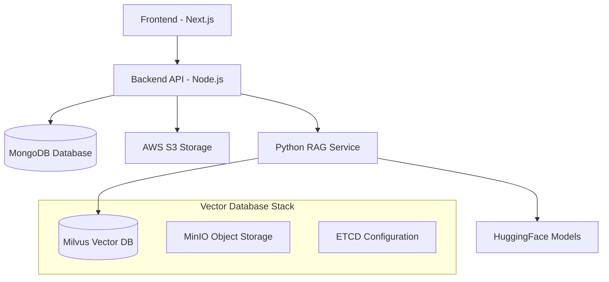

# 🎓 Capstone Project - Hệ thống RAG Chat với PDF

Dự án capstone này là một hệ thống trò chuyện thông minh sử dụng kỹ thuật **Retrieval-Augmented Generation (RAG)** để truy xuất và trả lời câu hỏi từ các tài liệu PDF. Hệ thống được xây dựng với kiến trúc microservices hiện đại, bao gồm frontend React/Next.js, backend Node.js, và RAG service Python.

## 🏗️ Kiến trúc hệ thống



## 🚀 Các thành phần chính

### 1. **Frontend (Next.js)** - `./client/`

- ⚡ Next.js 14 với App Router
- 🎨 Tailwind CSS + Radix UI components
- 🔐 Authentication với JWT
- 📱 Responsive design
- 💬 Real-time chat interface

### 2. **Backend API (Node.js)** - `./node-server/`

- 🚀 Express.js với TypeScript
- 🔐 JWT Authentication & Authorization
- 📁 File upload với AWS S3
- 📊 MongoDB với Mongoose
- 📝 Logging với Winston
- 🔒 Security với Helmet, CORS, Rate limiting

### 3. **RAG Service (Python)** - `./python-server/`

- 🤖 RAG pipeline với LangChain
- 🧠 HuggingFace Embeddings
- 🔍 Milvus Vector Database
- 📄 PDF processing
- 🔄 Hybrid search (Vector + BM25)

### 4. **Vector Database Stack**

- 🗄️ Milvus - Vector database
- 📦 MinIO - Object storage
- ⚙️ ETCD - Configuration management

### 5. **Translation Service** - `./translator/`

- 🌐 Đa ngôn ngữ support
- 🔄 VinAI translation provider

## 🛠️ Cài đặt và chạy dự án

### Yêu cầu hệ thống

- 🐳 Docker & Docker Compose
- 📦 Node.js 18+ (cho development)
- 🐍 Python 3.9+ (cho development)
- 💾 RAM tối thiểu: 8GB
- 💿 Disk space: 10GB+

### 🚀 Quick Start với Docker

1. **Clone repository**

```bash
git clone <repository-url>
cd capstone-project
```

2. **Cấu hình environment**

```bash
cp env.example .env
# Chỉnh sửa các biến môi trường trong file .env
```

3. **Khởi động toàn bộ hệ thống**

```bash
docker-compose up -d
```

4. **Kiểm tra trạng thái services**

```bash
docker-compose ps
```

### 🌐 Truy cập ứng dụng

- **Frontend**: http://localhost:3000
- **Backend API**: http://localhost:3001
- **Python RAG Service**: http://localhost:8080
- **Milvus Database**: http://localhost:19530
- **MinIO Console**: http://localhost:9001

## 📝 Environment Variables

Tạo file `.env` từ `env.example` và cấu hình các biến sau:

```bash
# Database
DB_URL=mongodb://localhost:27017/capstone

# JWT
ACCESS_TOKEN_VALIDITY_SEC=3600
REFRESH_TOKEN_VALIDITY_SEC=604800

# AWS S3
AWS_ACCESS_KEY_ID=your_access_key
AWS_SECRET_ACCESS_KEY=your_secret_key
AWS_REGION=ap-southeast-1
AWS_BUCKET=your_bucket_name

# Frontend
NEXT_PUBLIC_APP_URL=http://localhost:3000
NEXT_PUBLIC_API_URL=http://localhost:3001/api

# AI Models
EMBEDDING_MODEL=BAAI/bge-base-en-v1.5
HUGGING_FACE_HUB_TOKEN=your_hf_token
```

## 🧪 Development Setup

### Frontend Development

```bash
cd client
yarn install
yarn dev
```

### Backend Development

```bash
cd node-server
yarn install
yarn dev
```

### Python RAG Service Development

```bash
cd python-server
pip install -r requirements.txt
python app/main.py
```

## 📊 API Endpoints

### Authentication

- `POST /api/auth/register` - Đăng ký tài khoản
- `POST /api/auth/login` - Đăng nhập
- `POST /api/auth/refresh` - Refresh token

### File Management

- `POST /api/files/upload` - Upload PDF file
- `GET /api/files` - Lấy danh sách files
- `DELETE /api/files/:id` - Xóa file

### Chat/RAG

- `POST /api/chat` - Gửi câu hỏi và nhận phản hồi RAG

## 🗂️ Cấu trúc thư mục chi tiết

```
capstone-project/
├── client/                 # Frontend Next.js
│   ├── app/               # Next.js App Router
│   │   ├── components/        # React components
│   │   ├── hooks/            # Custom hooks
│   │   ├── utils/            # Utilities
│   │   └── types/            # TypeScript types
│   │
│   ├── node-server/          # Backend Node.js
│   │   ├── src/
│   │   │   ├── controllers/   # Route controllers
│   │   │   ├── models/       # MongoDB models
│   │   │   ├── services/     # Business logic
│   │   │   ├── middlewares/  # Express middlewares
│   │   │   └── routes/       # API routes
│   │   └── uploads/          # File uploads
│   │
│   ├── python-server/        # RAG Service Python
│   │   ├── app/
│   │   │   ├── core/         # Core RAG components
│   │   │   └── services/     # RAG services
│   │   ├── data/             # Sample documents
│   │   └── evaluation/       # RAG evaluation
│   │
│   ├── translator/           # Translation service
│   │   ├── configs/          # Translation configs
│   │   └── providers/        # Translation providers
│   │
│   └── docker-compose.yml    # Docker services configuration
```

## 🧪 Testing & Evaluation

### RAG Evaluation

```

```
