# System Architecture

## High-Level Component Diagram

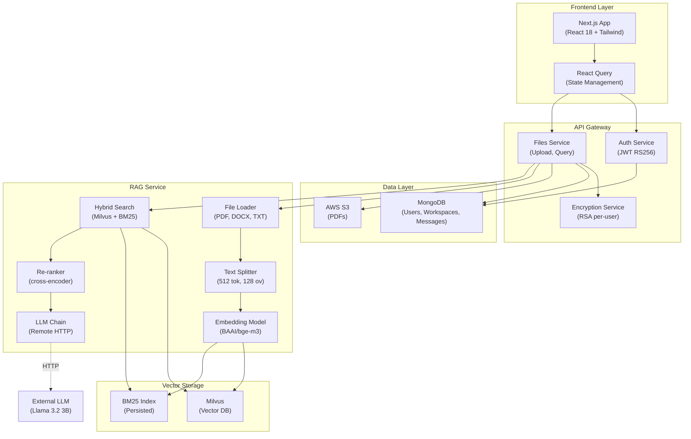

---

## Query Execution Flow

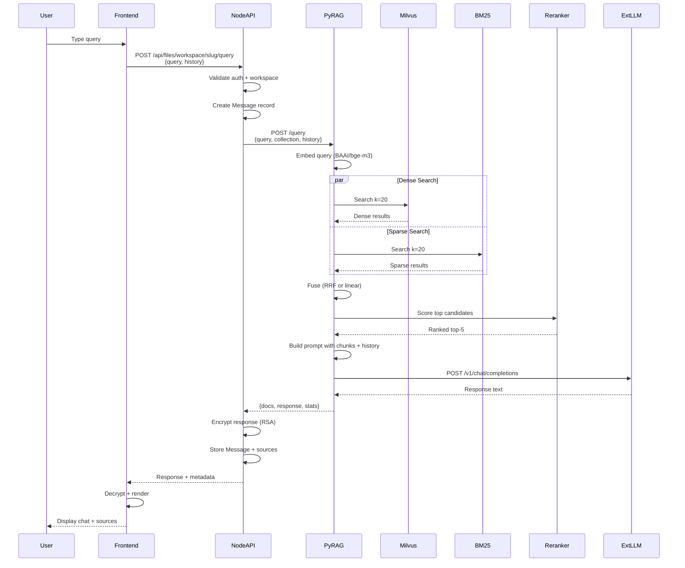

---

## Embedding & File Processing Pipeline

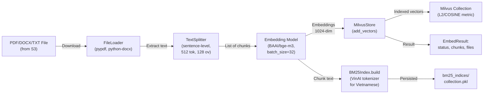

---

## Authentication & Key Rotation Flow

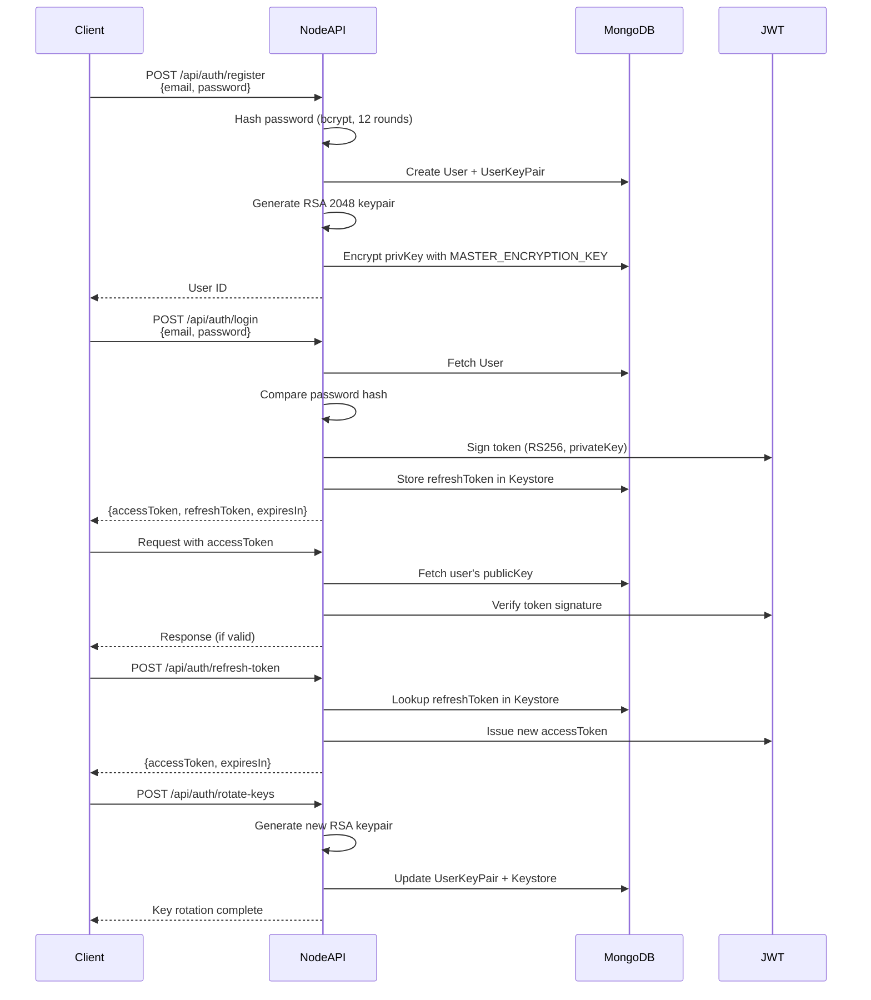

---

## Encryption/Decryption Flow

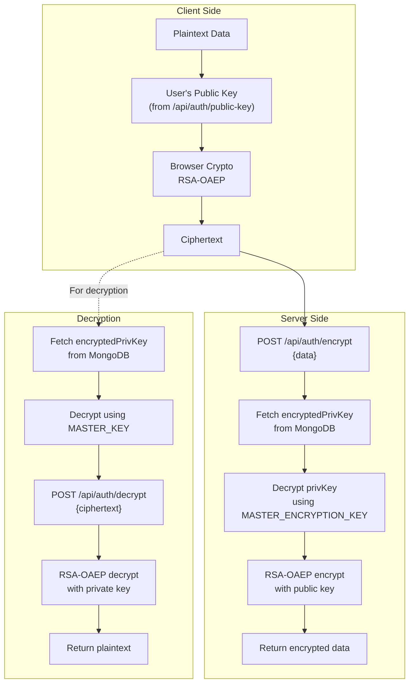

---

## Workspace Isolation Architecture

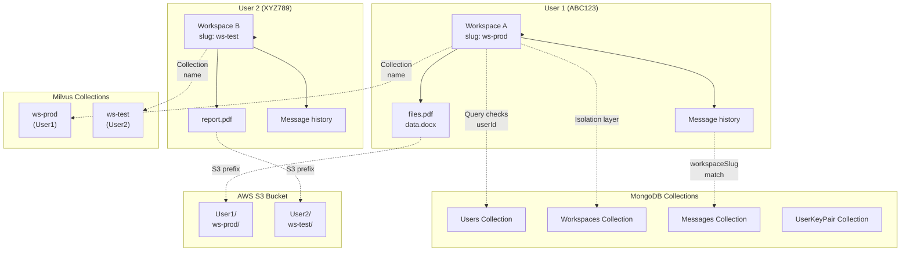

---

## Docker Compose Service Dependencies

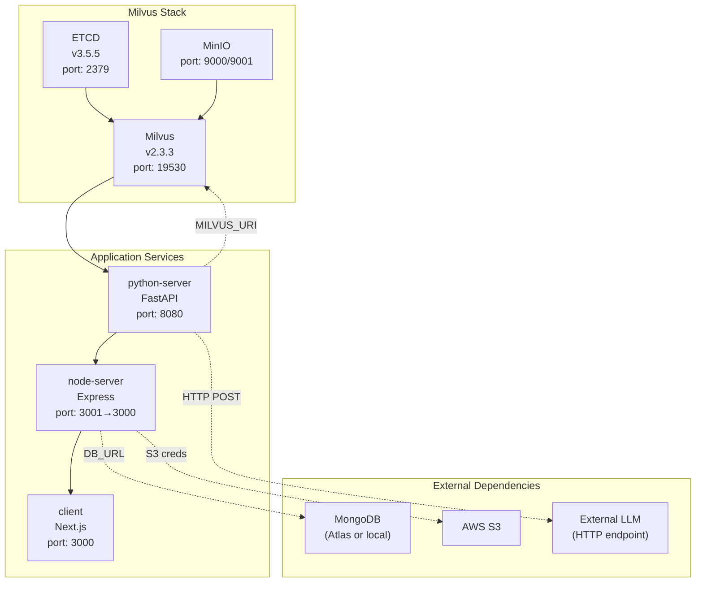

---

## Data Model Relationships

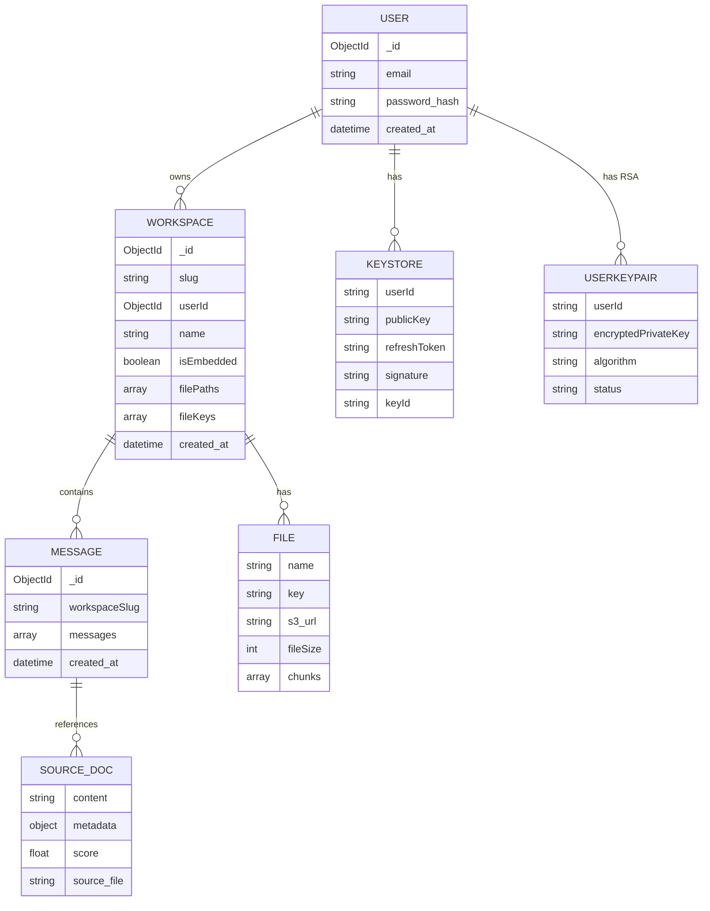

---

## Hybrid Search Fusion Logic

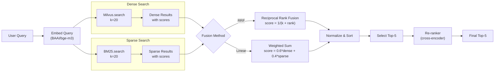

---

## Re-ranking Pipeline

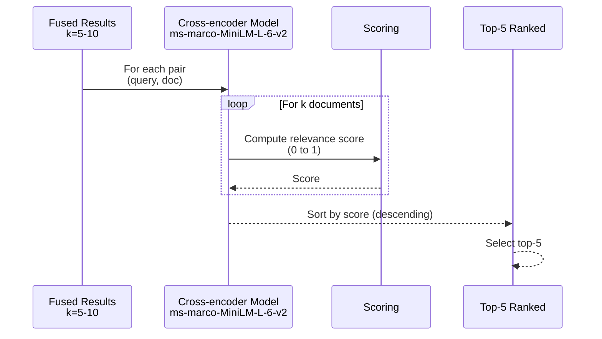

---

## Error Handling & Recovery

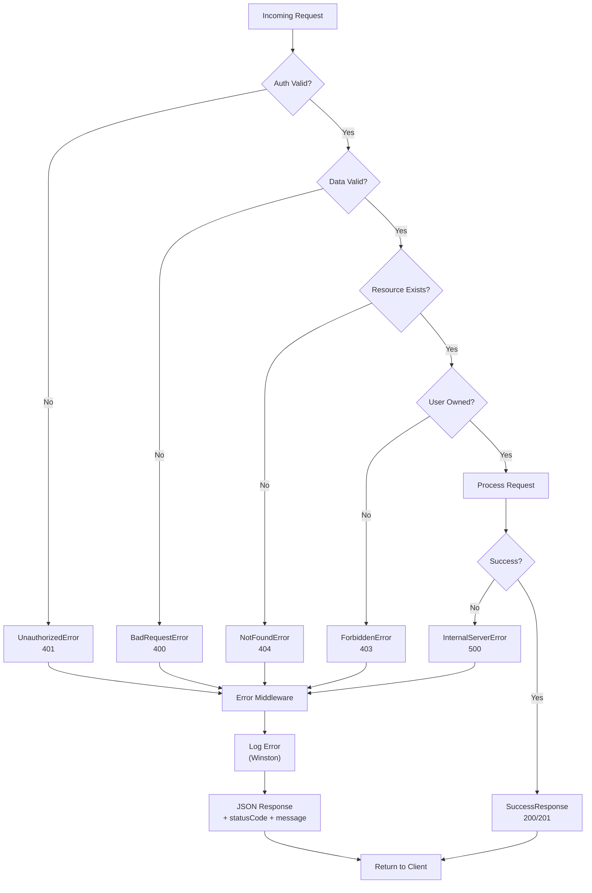

---

## Monitoring & Observability

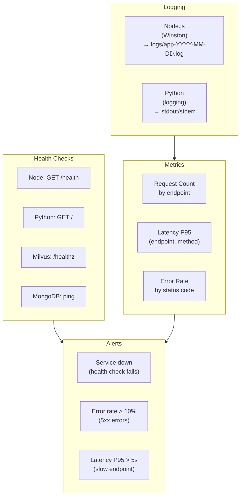

---

## Technology Stack Summary

| Layer | Technology | Version | Purpose |
|-------|-----------|---------|---------|
| **Frontend** | Next.js | 14.2.5 | SSR + App Router |
| | React | 18.2.0 | UI components |
| | Tailwind CSS | 3.3.2 | Styling |
| | TypeScript | 4.9.5 | Type safety |
| | TanStack React Query | 5.52.1 | State mgmt |
| **Backend API** | Express | 4.21.2 | HTTP framework |
| | TypeScript | 5.7.3 | Type safety |
| | Mongoose | 8.10.1 | MongoDB ODM |
| | JWT | 9.0.2 | Authentication (RS256) |
| | AWS SDK | v3 | S3 uploads |
| | Winston | 3.17.0 | Logging |
| **RAG Service** | FastAPI | 0.115.12 | Python async API |
| | BAAI/bge-m3 | 1.3.4 | Embeddings (1024-dim) |
| | pymilvus | 2.4.10 | Vector DB client |
| | rank-bm25 | 0.2.2 | Keyword search |
| | transformers | 4.51.3 | ML models |
| **Infrastructure** | Milvus | 2.3.3 | Vector database |
| | MongoDB | 5.0+ | Document store |
| | AWS S3 | - | File storage |
| | Docker | - | Containerization |
| | Docker Compose | - | Orchestration |

---

## Deployment Architecture (Production)

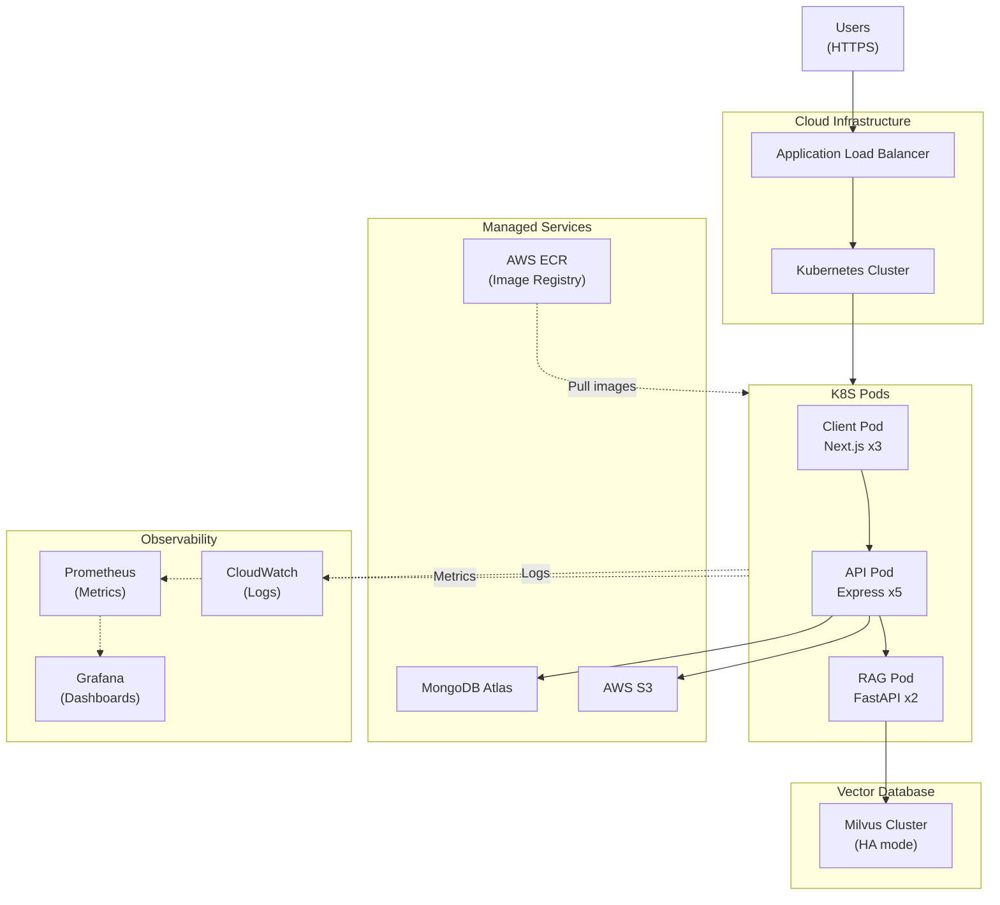

Currently deployed on **Docker Compose (single-machine)**. See [deployment-guide.md](./deployment-guide.md) for setup instructions.
