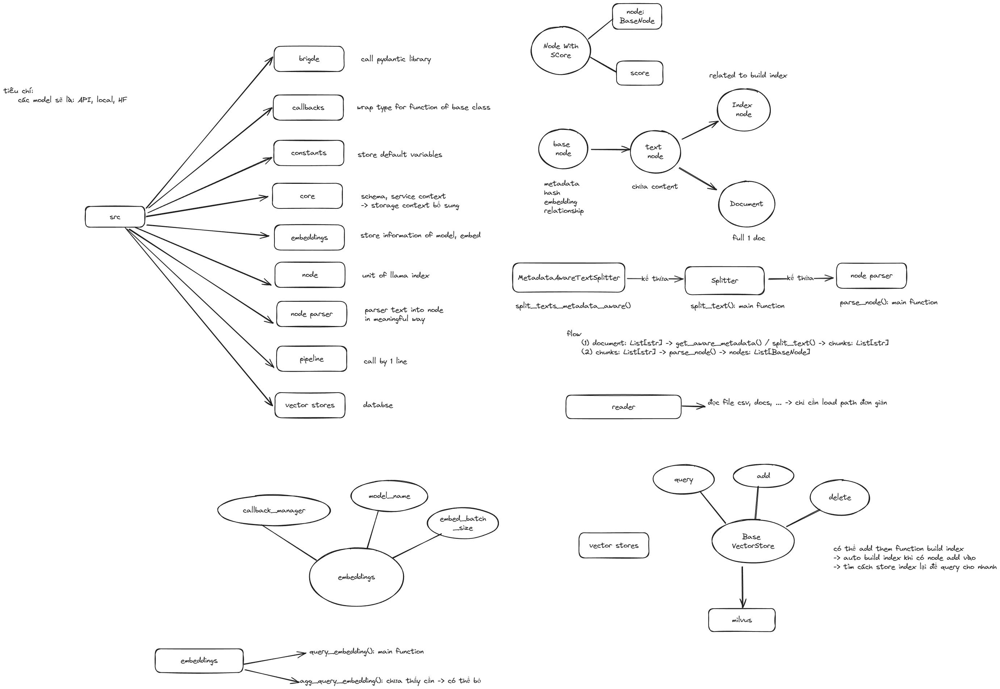

# backendDB - Hệ thống Xử lý và Truy xuất Tài liệu



Dự án này xây dựng một hệ thống toàn diện cho việc xử lý, lưu trữ, tạo embedding và truy xuất tài liệu. Hệ thống được thiết kế để xử lý tài liệu, chia thành các đoạn có kích thước phù hợp, tạo embedding vector, lưu trữ trong cơ sở dữ liệu vector và cung cấp cơ chế truy xuất hiệu quả.

## Cấu trúc Dự án

### Thư mục

- **src/**: Mã nguồn cốt lõi của dự án
  - **bridge/**: Các thành phần tích hợp
  - **callbacks/**: Cơ chế callback để giám sát quá trình
  - **configs/**: Quản lý cấu hình hệ thống
  - **constants/**: Các hằng số và định nghĩa của hệ thống
  - **core/**: Chức năng cốt lõi và các lớp cơ sở
  - **embeddings/**: Các mô hình embedding văn bản (HuggingFace, v.v.)
  - **engine/**: Các động cơ cơ sở dữ liệu để xử lý tài liệu
  - **node/**: Cấu trúc dữ liệu node cho biểu diễn tài liệu
  - **node_parser/**: Phân tích cú pháp và chuẩn hóa tài liệu
  - **pipeline/**: Pipelines xử lý tài liệu
  - **reader/**: Tiện ích đọc và tải tài liệu
  - **reranker/**: Cơ chế xếp hạng lại kết quả truy xuất
  - **retriever/**: Các thành phần truy xuất tài liệu
  - **storage/**: Cơ chế lưu trữ tài liệu
  - **utils/**: Các hàm tiện ích và trợ giúp
  - **vector_stores/**: Tích hợp cơ sở dữ liệu vector (Milvus)

- **examples/**: Các script ví dụ minh họa cách sử dụng
  - **milvus_with_law.py**: Ví dụ làm việc với tài liệu pháp luật
  - **retrieve_milvus.py**: Ví dụ truy xuất từ Milvus
  - **test_milvus_db.py**: Kiểm tra cơ sở dữ liệu vector Milvus

- **notebooks/**: Jupyter notebooks để minh họa
  - **test_splitter.ipynb**: Kiểm tra bộ chia tài liệu
  - **recursive_splitter.ipynb**: Demo về chia tài liệu đệ quy

- **gradio/**: Demo giao diện người dùng dựa trên Gradio
  - **deploy_gradio.py**: Triển khai Gradio để hiển thị kết quả truy xuất và xếp hạng lại

- **configs/**: Các tập tin cấu hình hệ thống
  - **embedding/**: Cấu hình mô hình embedding
  - **rerank/**: Cấu hình xếp hạng lại
  - **splitter/**: Cấu hình bộ chia tài liệu
  - **vector_store/**: Cấu hình cơ sở dữ liệu vector
  - **config.yaml**: Tập tin cấu hình chính

- **assert/**: Tài liệu hỗ trợ và hình ảnh
  - **backendDBpng.png**: Sơ đồ kiến trúc hệ thống

- **venv/**: Môi trường ảo Python

### Các Tập tin Chính

- **requirements.txt**: Các phụ thuộc Python
- **setup.py**: Thiết lập và cài đặt gói
- **LICENSE**: Giấy phép dự án

## Thành phần Hệ thống

### Pipeline Xử lý Tài liệu

1. **Đọc Tài liệu**: Đọc tài liệu từ nhiều nguồn và định dạng khác nhau
2. **Phân tích Tài liệu**: Chia tài liệu thành các node
3. **Tạo Embedding**: Tạo các vector embedding cho các node tài liệu
4. **Lưu trữ Vector**: Lưu trữ embedding trong cơ sở dữ liệu vector
5. **Truy xuất Tài liệu**: Truy xuất tài liệu liên quan dựa trên truy vấn
6. **Xếp hạng lại**: Tinh chỉnh kết quả truy xuất để tăng độ chính xác

### Tính năng Chính

- Hỗ trợ nhiều định dạng tài liệu
- Chia và chuẩn hóa tài liệu tùy chỉnh
- Tích hợp với cơ sở dữ liệu vector Milvus
- Tích hợp mô hình HuggingFace cho embeddings
- Pipelines truy xuất tùy chỉnh
- Giao diện web sử dụng Gradio

## Cài đặt và Sử dụng

### Thiết lập Môi trường
```
conda create -n backend python==3.10 -y
conda activate backend
pip install -r requirements.txt
```

### Thiết lập Máy chủ Milvus

#### Yêu cầu
Máy chủ Milvus chạy trên Docker. Vui lòng cài đặt:
1. [Docker](https://docs.docker.com/engine/install/)
2. [Điều kiện tiên quyết của Docker cho Milvus](https://milvus.io/docs/prerequisite-docker.md)

#### Cài đặt Milvus
```
wget https://github.com/milvus-io/milvus/releases/download/v2.3.2/milvus-standalone-docker-compose.yml -O docker-compose.yml
```

#### Khởi động Milvus
```
sudo docker-compose up -d
sudo docker compose ps
docker port milvus-standalone 19530/tcp
```

### Kiểm tra Bộ chia Tài liệu
Sử dụng notebook `notebooks/test_splitter.ipynb` với các tham số chính:
- `separator`: Phân cách chuỗi (mặc định: " ")
- `chunk_size`: Kích thước của các đoạn văn bản (mặc định: 200)
- `chunk_overlap`: Sự chồng lấp giữa các đoạn (mặc định: 20)
- `paragraph_separator`: Phân cách đoạn văn (mặc định: "\n\n\n")
- `secondary_chunking_regex`: Regex cho việc chia thứ cấp (mặc định: "[^.。？！]+[.。？！]?")

### Các Trường hợp Sử dụng

#### Xử lý Tài liệu Chung
Xem các ví dụ trong thư mục `examples/`, với các bước sau:
1. Sử dụng `DirectoryReader` để tải tài liệu
2. Khởi tạo cấu hình Hydra và truyền vào `ConfigurationManager`
3. Tạo và chạy pipeline từ `src.pipeline`

#### Cơ sở dữ liệu Tài liệu Pháp luật
Xử lý tài liệu pháp luật từ các tệp CSV:
```
python examples/milvus_with_law.py
```

#### Giao diện Hiển thị Kết quả Truy xuất
```
python gradio/deploy_gradio.py
```

## Công nghệ Sử dụng

- **Cơ sở dữ liệu Vector**: Milvus
- **Mô hình Embedding**: HuggingFace, sentence-transformers
- **Cấu hình**: Hydra, OmegaConf
- **Giao diện người dùng**: Gradio
- **Xử lý Tài liệu**: pdfminer.six, docx2txt, pypdf
- **Machine Learning**: transformers, sentence-transformers

## Quy trình Làm việc Chi tiết

### 1. Tiền xử lý Tài liệu
- Tài liệu được tải từ nhiều nguồn (PDF, DOCX, text, CSV) thông qua các reader chuyên biệt
- Văn bản được chuẩn hóa để loại bỏ các ký tự đặc biệt, khoảng trắng thừa và định dạng không cần thiết
- Tài liệu được chia thành các đoạn nhỏ (chunks) dựa trên cấu hình được chỉ định (kích thước đoạn, độ chồng lấp)

### 2. Tạo và Lưu trữ Embedding
- Mỗi đoạn văn bản được chuyển đổi thành vector embedding bằng các mô hình từ HuggingFace
- Các vector được lưu trữ trong Milvus với metadata kèm theo (nguồn, vị trí trong tài liệu gốc)
- Milvus cung cấp khả năng tìm kiếm hiệu quả trong không gian vector đa chiều

### 3. Truy vấn và Truy xuất
- Truy vấn người dùng được chuyển đổi thành vector embedding
- Hệ thống tìm kiếm các vector gần nhất trong không gian embedding
- Kết quả được xếp hạng lại dựa trên độ liên quan để tăng độ chính xác

### 4. Tích hợp và Triển khai
- Hệ thống có thể được tích hợp vào các ứng dụng khác nhau thông qua API
- Giao diện Gradio cung cấp cách trực quan để tương tác với hệ thống
- Các pipeline có thể được tùy chỉnh cho các trường hợp sử dụng cụ thể

## Phát triển và Mở rộng

### Thêm Nguồn Dữ liệu Mới
Để thêm hỗ trợ cho một định dạng tài liệu mới:
1. Tạo một reader mới trong thư mục `src/reader/`
2. Triển khai các phương thức xử lý để chuyển đổi định dạng thành văn bản thuần túy
3. Tích hợp reader mới vào pipeline xử lý

### Thay đổi Mô hình Embedding
Để sử dụng mô hình embedding khác:
1. Tạo một class mới trong thư mục `src/embeddings/`
2. Triển khai các phương thức cần thiết để tạo embedding từ văn bản
3. Cập nhật cấu hình trong `configs/embedding/`

### Triển khai Cơ sở dữ liệu Vector Khác
Để sử dụng cơ sở dữ liệu vector khác Milvus:
1. Tạo một class mới trong thư mục `src/vector_stores/`
2. Triển khai các phương thức cho việc lưu trữ và truy xuất vector
3. Cập nhật cấu hình trong `configs/vector_store/`